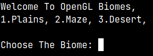
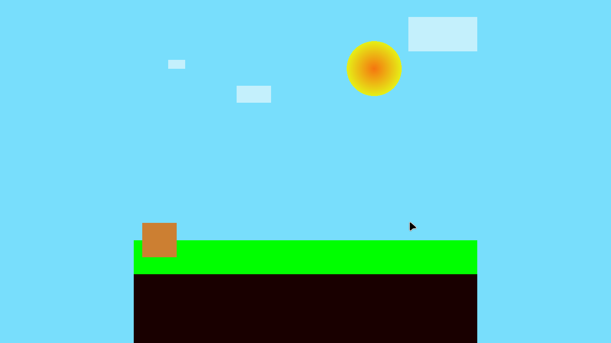
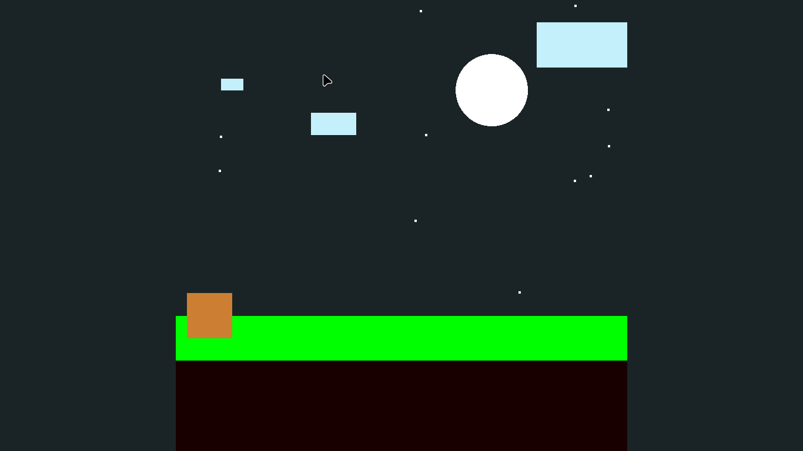
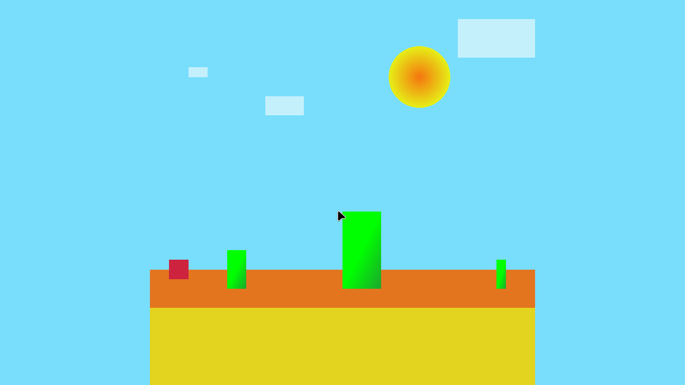
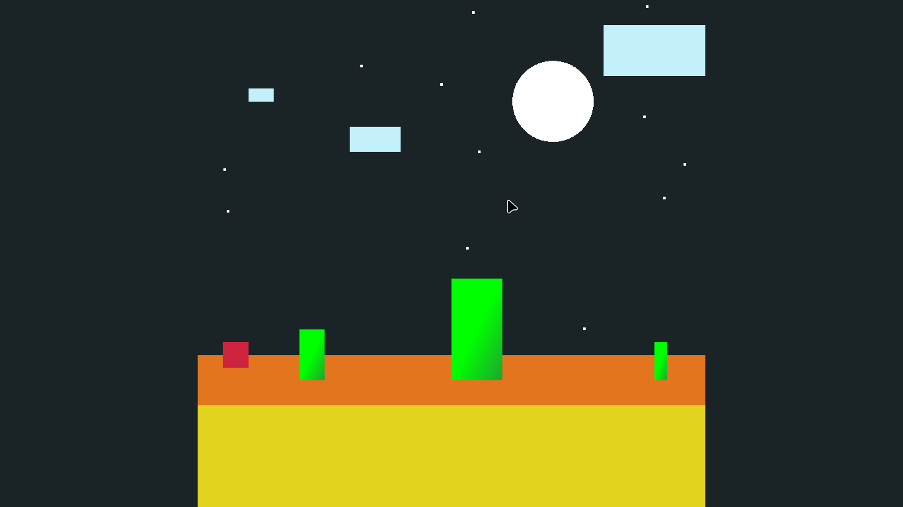

# OpenGL Biomes

I like **Minecraft** biomes so much, and this projects is inspired by it.

It contains mainly 3 biomes right now, **Plains**, **Maze**, **Desert**.

## Controls

- Press `Space Bar` to cycle through between day and nights.
- Press `Left Mouse Button` to change cube color and stars positions randomly.

## Building

```bash
make
make run
```

To delete object file,

```bash
make clean
```



## Rendered Output

### Plains





### Desert




